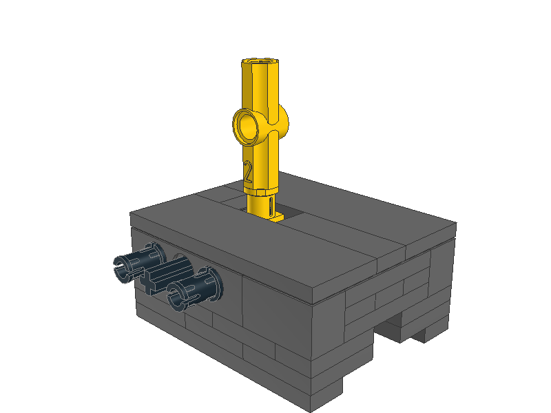

# 4531-1 - Manual Points

To motorize a track switch (manual point) build at least one of the build in the image below. for more information about the build see the [model.ldr](model.ldr) file.

You also need a [Large Powered Up Motor](https://rebrickable.com/parts/22169/motor-large-powered-up/72/). The motor can be attached to both sides of the track switch by pushing the axle through and placing the pins on the other side.

The idea of the model from my part was from this [YouTube video by The Technic Gear LEGO Reviews](https://youtu.be/qWDMIOtVFSY), the initial idea seems to be by [user skaako on Eurobricks](https://www.eurobricks.com/forum/index.php?/forums/topic/67730-ronald-vallenduuks-power-functions-points-motor/&tab=comments#comment-1256146).

## Software

The software is written in such a way that you can connect up to 4 track switches to each of the ports of the Powered Up Technic Hub. It doesn't matter which port you use or how many you use.

At first start the ports are checked for a motor and if a motor is present it is calibrated.

The buttons on the remote switches the following ports:

| Button             | A | B | C | D |
|--------------------|---|---|---|---|
| Left +             | X |   |   |   |
| Left -             |   | X |   |   |
| Right +            |   |   | X |   |
| Right -            |   |   |   | X |
| Left middle (red)  | X | X |   |   |
| Right middle (red) |   |   | X | X |
| Center (green)     | X | X | X | X |

The switch can also be turned over manualy. The software is aware of its position before it will switch over the next time.

The LED on the hub will represent the battery voltage according to the table below.

| Voltage           | Color  |
|-------------------|--------|
| Above 9.0 Volt    | Green  |
| Above 8.1 Volt    | Yellow |
| Above 7.2 Volt    | Orange |
| 7.2 Volt or below | Red    |

## Advise

Make sure your manual point(s) turn over smoothly or the motor can not provide the power to turn it over.

## Disclaimer

LEGO® is a trademark of the LEGO Group of companies which does not sponsor, authorize or endorse this project.
